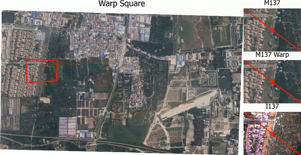
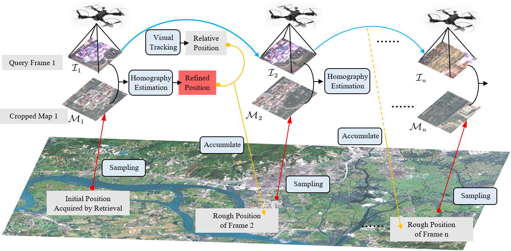

# Leveraging Map Retrieval and Alignment for Robust UAV Visual Geo-Localization
* [Introduction](#Introduction)
* [Get Started](#Get-Started)
* [Absolut Localization Flow](#Absolut-Localization-Flow)
* [Code Structure](#Code-Structure)
* [Resources Download](#Resources-Download)
* [Acknowledgements](#Acknowledgements)
* [Citation](#Citation)

## Introduction
This project focuses on development of a robust geo-localization system on aerial platform leveraging deep-learning based map retrieval and alignment. 
Two public datasets from [Ageagle](https://ageagle.com/resources/?filter_by=data-set) have been re-organized  to evaluate the proposed algorithms.
A field test in Beijing Haidian has been also conducted to demonstrate the effectiveness of the localization system.	

**Input data:** orthophoto and the target referenced map

**Output data:** extracted geo-coordinates

<p align="center">
  
</p>

## Get-Started

**Install dependencies:**

The environment we use can be seen in `setup/environment.yml`.
Note this project is mainly built based on the `pytorch` without many additional dependencies.
And this environment list can be referred if there is any conflicts of dependencies.

**Prepare the dataset:**	

We use the pre-stored images to represent the scenes captured during the flight.

* Our datasets: please download the datasets and input in the `dataset` directory.
* Custom dataset: please make sure the map contains the actual geo-coordinates and the file of the query images should be re-named as such format: `@index@longitude@latitude@`.

**Test on the dataset:**

Please make sure the paths for the pretrained weights and the datasets are correct.
With the evaluation for the Ageagle dataset, simply run:

```
python main.py
```

If other datasets need to be tested, please change the configuration in `utility/config.py`.

## Absolute-Localization-Flow
<p align="center">
  
</p>

The fine localization is achieve with frame-to-map alignment. For more details, please refer to the `main.py` and files in `scripts/`.

## Code-Structure
The file structure is shown as the following. 
At present, we only provide the main files, and all the related files will be released after the article is published.

```
.
+--- asset          # asset for this repository
+--- datasets       # path to save the geo-referenced map and captured frames
+--- models         # path to save the pretrained network weights
+--- scripts        # essential scripts for network models
+--- setup          # statement for the dependencies
+--- utility        # essential utilities to load image and visualize
+--- main.py        # main programme
+--- README.md      

```

## Resources-Download

* DATASETS: All the datasets for this research have been open-sourced at the [this link](https://cloud.tsinghua.edu.cn/d/eebd9d4c83eb4fe2b20c/).

* Pretrained Weights: The pretrained weights have been also given at the [this link](https://cloud.tsinghua.edu.cn/d/eebd9d4c83eb4fe2b20c/).

(only the Ageagle datasets are available at present and other dataset will be provided after our article is accepted.)

## Acknowledgements 

In particular, we appreciate the following online resources to support the training and testing in this work.

* [Ageagle](https://ageagle.com/resources/?filter_by=data-set)
* [USGS](https://earthexplorer.usgs.gov/)

We also express our gratitude for these open-sourced researches and parts of this work are inspired by them.

* [HF-Net](https://github.com/ethz-asl/hfnet)
* [2019 ICRA Goforth](https://github.com/hmgoforth/gps-denied-uav-localization)
* [DVGL Benchmark](https://github.com/gmberton/deep-visual-geo-localization-benchmark)
* [NetVLAD](https://github.com/lyakaap/NetVLAD-pytorch)

## Citation

(related publication waiting for reviewing)
